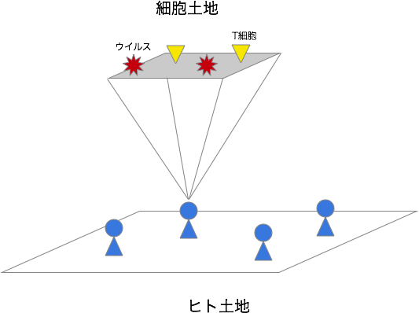

<h2>&#30446;&#27425;</h2>

<ul>
<li><a href="#sec-1">1. 宿主内動態組込型ABM</a></li>
<li><a href="#sec-2">2. モデル</a></li>
<li><a href="#sec-3">3. 計算の流れ</a></li>
</ul>

# 宿主内動態組込型ABM

1.  目的

    宿主内でのウイルスの進化ゲームを見る。  

2.  概要

# モデル

1.  登場するエージェント

    1.  *細胞*
    
        1.  正方形状に配置されている。
        
        2.  この上を、T細胞が移動する。
    
    2.  *T細胞*
    
        1.  移動する。
        
        2.  ウイルスと同じ位置に移動すると、ウイルスを除去し、自身を複製する。
    
    3.  *細胞土地*
    
        1.  正方形状の土地。
        
        2.  T細胞が移動する。
    
    4.  *ウイルス*
    
        1.  遺伝子を持つ。
        
        2.  細胞に感染する。
    
    5.  *ヒト*
    
        1.  ヒト土地上を移動する。
        
        2.  体内の感染細胞の割合が、閾値を超えると、症候性期間に入る。
        
        3.  症候性期間に入ると、他ヒトに感染させる能力を持つ。
    
    6.  *ヒト土地*
    
        1.  正方形状の土地。
        
        2.  ヒトが移動する

2.  イメージ図

      

# 計算の流れ

1.  T細胞の移動  
    1.  T細胞が細胞土地の上を移動する。
2.  細胞の接触  
    1.  各細胞に対して近隣の細胞を取得し、
    2.  各近隣に対して、 **その近隣の細胞内ウイルス密度が閾値を超えていれば、**
    3.  その近隣のウイルスを、自分の待機ウイルスに加える。
3.  細胞の感染  
    1.  各細胞に対して
    2.  自分の待機ウイルスの内から１つ自分に感染させる。
4.  T細胞による殺傷  
    1.  各T細胞に対して、T細胞が、
    2.  同じ位置にある細胞の感染ウイルスのタグを含んでいれば、
    3.  **細胞内ウイルス密度に比例した確率** で、（最大なら100%）
    4.  ウイルスを除去する。  
        1.  除去した場合、同じタグを持つT細胞をその位置で複製する。
5.  T細胞の寿命  
    1.  各T細胞に対して、
    2.  １つ年齢を増やし、
    3.  寿命を超えていれば、  
        1.  **指定された確率で、メモリーT細胞になる。**
        2.  そうでない場合、除去される。
6.  ウイルスの増殖  
    1.  各細胞に対して、
    2.  感染細胞ならば、
    3.  最大保持ウイルスを超えていなければ、
    4.  指定されたウイルス増殖率で、
    5.  **保持しているウイルスをクローンして１つ増やす。**